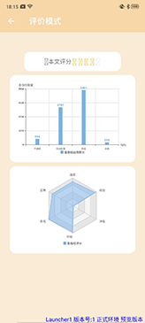
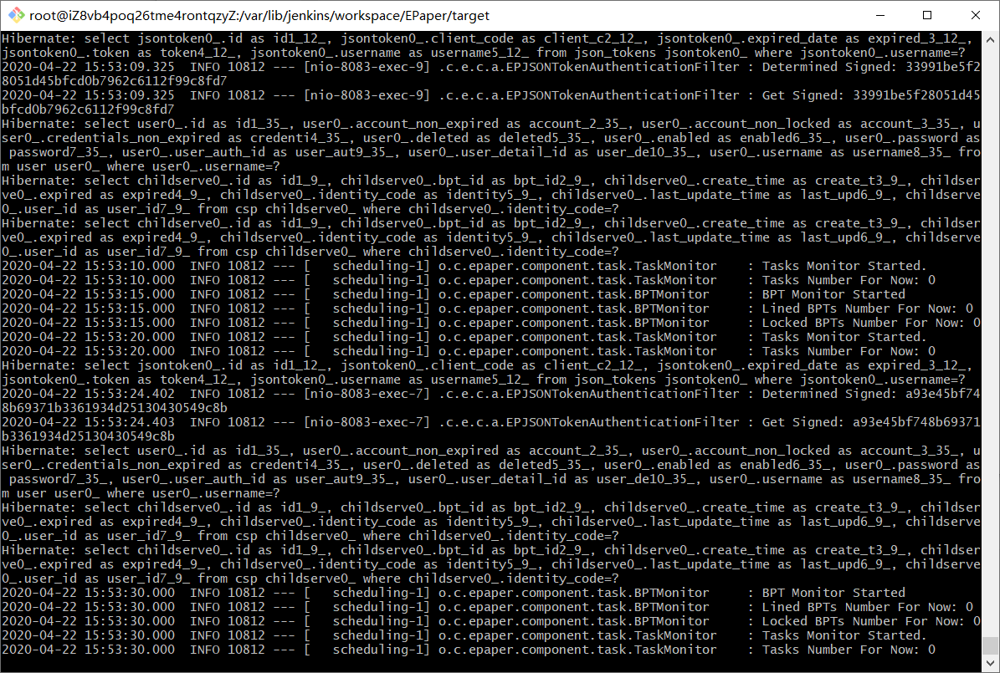
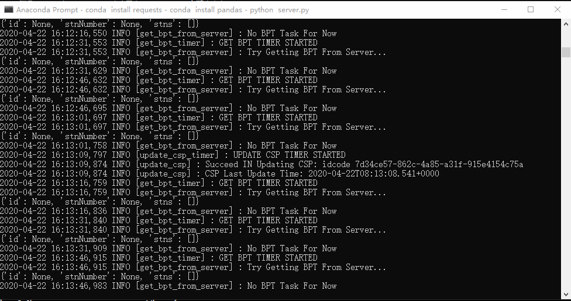

# 智慧学术论文行文指导快应用软件系统

**写在前面** 所提交的代码不包括神经网络模型的数据文件，但包含神经网络模型运作的所有相关代码。数据库的结构与数据导入文件，在主服务端的SQL目录下。我们在开发、测试时，数据库选用的是MariaDB 10.2。主服务端的Jenkins的自动部署脚本，在Scripts目录下。快应用端物联网部分，因为疫情影响尚不能正常使用。

声明：软件系统涉及的所有代码、技术研究均在赛程内完成。

## 软件系统介绍

### 项目概要

本项目立足于自然语言处理最新、最有效的模型与技术，致力于解决中文学术论文写作过程中的错别字、通顺程度与书面语规范的问题。它的核心技术基于NLP领域中的词向量技术、Attention机制、预训练技术与中文全词遮罩技术，并且深度利用BERT（Bidirectional Encoder Representation from Transformers）预训练模型在文本分类任务的良好表现，辅之以ERNIE模型在错字检测、语句通顺程度评估任务中的优势。本项目在上述几项关于中文学术论文的行文指导问题的求解上能够达到该领域现有技术水平下较好的效果。

### 软件系统呈现形式

该项目产品软件系统最终将以三部分呈现

- **快应用端**（QuickApp）
- **主服务端**（Main Server）
- **分布式GPU计算端**（DistributedGPUCalculationServer）

1. **<u>产品与用户交互的部分以快应用的形式呈现</u>**，用户通过快应用界面使用产品的所有功能，快应用端将采取简化设计，尽可能对用户隐藏不必要的复杂机制，降低学习成本。另外，快应用端也将具备一定的设备间交互能力，使得用户能够在常用设备间传递运算结果。**<u>这部分在设计上也称为客户端、前端。</u>**客户端功能主要分为三大类：启发模式、评价模式与进步情况。
2. 产品的针对文本的章结构、段结构、句结构、词结构的**<u>预处理与文本的预分析功能将部署在主服务端</u>**。主服务端在逻辑上只能够有一个，且由主服务端通过Restful API的设计风格的接口与快应用端进行通信。一方面，主服务端将使用异步处理技术与线程池技术对快应用端发来的数据进行处理。另一方面，主服务端将通过协议将经过预处理与预分析的数据分发给一个或者多个分布式GPU计算端。**<u>主服务端我们也将简要的称为服务端、后端。</u>**
3. 为了解决深度学习预训练模型的运算的复杂程度高、要求GPU单独占用、服务器租用成本高、启动时间长的难题，本项目结合预训练模型的特点、系统整体吞吐量与运算效率的因素，经过权衡，**<u>我们创新性地为BERT预训练模型编写了分布式GPU计算端模块</u>**。用户通过快应用端上传的文本数据在主服务器端经过预处理与预分析后，通过原创的分布式计算协议与基于优先级的调度算法（使用子服务器护照与签证的概念），批量分发到多个分布式GPU计算端进行深度学习神经网络运算处理。多个分布式GPU计算端对主服务端批量分发的文本数据进行并行计算后，整个系统将在尽可能短的时间内批量输出多个用户上传文本的运算结果，而后运算结果将通过协议从分布式GPU计算端送回主服务端。分布式GPU计算端在提高系统的总吞吐量的同时，也大大降低了部署成本。**<u>分布式GPU计算端，我们将简称为计算端。</u>**

### 快应用端介绍

快应用端核心功能主要分为三大类：启发模式、评价模式与进步情况。

1. 启发模式含有一个单向流程，而一个流程有三个步骤。每个步骤下，客户端将使用不同的方法扫描并标记出用户提交的学术论文中出现的各种问题，然后客户端辅助用户发现、修改该阶段学术论文中的特定问题。与启发模式三个阶段相对应的三个主要子功能为：对用户的输入的中文学术论文文本进行打字错误检测与修正、句子通顺程度的检测与提示、句子口语化问题与情感偏差的检测与指导方案的生成。
2. 打字错误的检测与修正是自然语言处理模型结合上下文对用户输入的中文学术论文文本中的一些错字、别字与偶尔的打字错误（如与输入法有关的拼音相近或笔画相近的输入错误）的检测，并在这些地方做出标记，然后结合模型提示给出修改建议，用户可以根据自己的需要决定是否接受系统给出的修改建议。
3. 句子口语化问题与严谨性问题的检测与指导方案的生成是通过自然语言处理模型的文本分类应用模型，逐句对学术论文中的句子进行文本分类操作，找出口语化成分过多的句子，并做出标记提示用户进行修改。而后，快应用端将对经过初步处理后的句子进行逐一扫描，来剥离文本中不符合学术论文一般表达习惯的句子。最后，将对不严谨的句子做出标记，并将指导方案呈现给用户，这样可以大大提升学术论文的整体严谨度。
4. 快应用端的评价模式可以针对论文给出综合加权分数的功能，用户将通过引导来进入评价模式获取分数。

用户初次使用本软件时，系统会为用户提供指示说明，一步一步带领用户如何操作、使用本软件。用户可以在首页输入需要修改的文章/文段，输入方式有在文本框中输入文字和导入word文档两类方式，输入完成之后点击提交。用户输入的文字就被传送到服务端进行处理，并在“我的”页面展示文档处理状态：正在处理/已处理完。

当文档处理完之后会通过**快应用卡片**的形式通知用户可以查看。用户点击需要查看的文档之后，可以选择进入修正模式还是启发模式。其中进入修正模式，会将修改之后完整的文章展现在屏幕上，用户可以根据需要**导出或连接蓝牙打印机打印文章**。若进入启发模式，本产品会将文章中每个句子的错误/不足之处用高亮标出，其中红色高亮为错别字，黄色高亮为句子情绪过于消极/积极，绿色高亮为句子不通顺。用户可以点击每个句子查看各个句子的修改建议，已完成论文的局部修改。

除此之外，用户还可以在首页查看个人的进步状态，其中包括了用户自使用本产品以来，每篇文章的评分曲线图以及每篇文章的错误饼状图，以帮助用户结合自身情况更好的书写文章和发展进步。

### 技术特点

- 深度结合**快应用技术与快应用卡片技术**，能够较好地融入使用场景，使软件的使用非常方便、快捷。
- 能够连接蓝牙打印机与各个可用设备（疫情影响，尚在开发测试中），具备一定的**物联通信能力**。
- 主服务端采用基于Jenkins的**自动构建、自动部署**的方案，对服务器的硬件与网络要求较低。
- 分布式GPU计算端的部署采取多计算机部署的方案，支持根据系统的事实际负载增减计算端数量。
- 分布式GPU计算端只要求部署的计算机能够连接到互联网。另外，计算端允许NAT转发的存在。**对网络环境的要求低**。
- 在运算能力上，分布式GPU计算端不要求计算端具备有性能较强的GPU。在CPU能力足够的情况下，计算端甚至**可以不安装GPU就能正常作业**。AI能力的部署**成本大大降低**。
- 分布式GPU计算端具备有**很强的鲁棒性**，能够在失去主服务端连接的情况继续待机运行。一旦与主服务端的连接恢复正常，分布式GPU计算端能够自动恢复到正常作业状态。
- 在经过我们精心调整与训练，我们的神经网络模型的对于句粒度口语化文本检测准确度超出了我们的预料，**达到了95%**（在某种程度上超过了人类）。
- 主服务端使用**异步处理技术与线程池技术**对快应用端发来的数据进行处理，使得主服务端的对于计算型任务请求的响应速度大大提升。

### 主体软件框架及主要开发语言

#### 快应用（JavaScript）

#### 主服务端（Java）

Spring Boot、Spring Web、 Spring Security

#### 分布式GPU计算端（Python）

TensorFlow、BERT


## 功能介绍

### 系统层次

#### 快应用端

````
├─assert
│  └─image 图片素材
├─cards 快应用卡片
├─Common
├─Components 组件
├─Home 主页
├─Improvement 进步曲线
├─Inspire_result 激励页面
├─Mypage “我的”页面
├─styles UI风格
├─tab_bar 顶部栏
├─User_login 用户登录
├─utils 工具
└─Value_result 处理结果
````

#### 主服务端

**源码层次** 源代码文件EP前缀代表EPaper（产品英文名）。对于一些缩写以下给出解释：BPT代表批处理任务，CSP代表子服务器护照，STN代表句子。

```
卷 系统 的文件夹 PATH 列表
卷序列号为 805E-47C9
C:.
│  
├─main
│  ├─java
│  │  └─org
│  │      └─codedream
│  │          └─epaper
│  │              │  EpaperApplication.java 入口
│  │              │  
│  │              ├─component 组件集合
│  │              │  │  EPSpringUtil.java
│  │              │  │  
│  │              │  ├─api API接口组件
│  │              │  │      QuickJSONRespond.java
│  │              │  │      
│  │              │  ├─article 章结构组件
│  │              │  │      GetSentenceFromArticle.java
│  │              │  │      
│  │              │  ├─auth 认证与验证类组件
│  │              │  │      AJAXRequestChecker.java Ajax请求检查
│  │              │  │      AuthTokenGenerator.java token生成器
│  │              │  │      EPAccessDecisionManager.java 账号权限处理
│  │              │  │      EPAccessDeniedHandler.java 无权限访问处理
│  │              │  │      EPAuthenticationEntryPoint.java 未验证处理
│  │              │  │      EPAuthenticationFailureHandler.java 认证失败处理
│  │              │  │      EPAuthenticationSuccessHandler.java 认证成功处理
│  │              │  │      EPJSONTokenAuthenticationFilter.java （身份验证过滤器）
│  │              │  │      EPPasswordEncoder.java 密码编码器
│  │              │  │      EPSecurityAuthenticationProvider.java 身份认证方式
│  │              │  │      EPUsernameEncoder.java 用户名编码器（目前未使用）
│  │              │  │      EPUsernamePasswordAuthenticationFilter.java 用户名密码认证过滤器
│  │              │  │      JSONRandomCodeGenerator.java 随机特征值生成器
│  │              │  │      JSONSignedGenerator.java 客户端签名生成器（用于验证）
│  │              │  │      JSONTokenAuthenticationToken.java 认证数据结构
│  │              │  │      JSONTokenUsernamePasswordAuthenticationToken.java 认证数据结构
│  │              │  │      SHA1Encoder.java
│  │              │  │      TimestampExpiredChecker.java 时间戳处理
│  │              │  │      
│  │              │  ├─batchthread 批处理任务类组件
│  │              │  │      ComparableFutureTask.java
│  │              │  │      TaskAppointer.java
│  │              │  │      
│  │              │  ├─cache 缓存类组件
│  │              │  │      ScheduleCacheTask.java
│  │              │  │      
│  │              │  ├─datamanager 数据处理类组件
│  │              │  │      FileParser.java 文件处理
│  │              │  │      JSONParameter.java JSON处理
│  │              │  │      ParagraphDivider.java 分段处理
│  │              │  │      SentenceDivider.java 分句处理
│  │              │  │      SentenceSmoothnessGetter.java 预分析处理
│  │              │  │      SHA256Encoder.java
│  │              │  │      SHA512Encoder.java
│  │              │  │      StringFile.java 字符串文件（未使用）
│  │              │  │      StringFileGenerator.java 字符串文件生成器
│  │              │  │      TextCorrector.java 错字处理
│  │              │  │      WordParser.java 文档解析
│  │              │  │      
│  │              │  ├─json JSON相关设计模型
│  │              │  │  │  JSONBaseObject.java 所有有效的JSON对象模板
│  │              │  │  │  
│  │              │  │  ├─model JSON设计模型（用于API接口返回）
│  │              │  │  │      JsonableBPT.java 批处理任务JSON设计模型
│  │              │  │  │      JsonableBPTResult.java
│  │              │  │  │      JsonableCSP.java 子服务器护照JSON设计模型
│  │              │  │  │      JsonableFile.java
│  │              │  │  │      JsonableSTN.java 句子JSON设计模型
│  │              │  │  │      JsonableSTNError.java
│  │              │  │  │      JsonableSTNPage.java
│  │              │  │  │      JsonableSTNResult.java
│  │              │  │  │      JsonableTask.java
│  │              │  │  │      JsonableTaskResult.java
│  │              │  │  │      JsonableUser.java
│  │              │  │  │      
│  │              │  │  ├─request JSON基本请求设计模型
│  │              │  │  │      UserLoginChecker.java 用户登录请求对象设计模型
│  │              │  │  │      
│  │              │  │  └─respond JSON基本应答设计模型
│  │              │  │          EmptyDataObjectRespond.java 空应答设计模型
│  │              │  │          ErrorInfoJSONRespond.java 错误信息对象
│  │              │  │          JSONBaseRespondObject.java 服务端返回的JSON对象标准模板
│  │              │  │          UserLoginCheckerJSONRespond.java 用户登录请求应答模型
│  │              │  │          
│  │              │  ├─server 子服务器管理类组件
│  │              │  │      CSPUpdater.java 护照管理
│  │              │  │      
│  │              │  └─task 任务类组件
│  │              │          ArticlePreprocessor.java 章预处理器
│  │              │          BPTDivider.java 批处理任务拆分
│  │              │          BPTMonitor.java 批处理任务监视
│  │              │          BPTQueue.java 批处理任务优先队列
│  │              │          JsonableTaskResultGenerator.java 子任务JSON设计模型生成器
│  │              │          LockedBPTs.java 批处理任务锁定队列
│  │              │          ParagraphProcessor.java 段预处理器
│  │              │          SentenceAnalyser.java 句预分析器
│  │              │          SentencePreprocessor.java 句预处理器
│  │              │          TaskAnalyser.java 子任务预分析器
│  │              │          TaskMonitor.java 子任务监视
│  │              │          TaskQueue.java 子任务队列
│  │              │          
│  │              ├─configure 配置集合
│  │              │      AppConfigure.java 全局配置
│  │              │      BatchTaskConfiguration.java 批处理任务配置
│  │              │      ComponentsConfigure.java 组件配置
│  │              │      CustomWebSecurityConfig.java 有关pingSecurity的配置
│  │              │      EPApplicationContextInitializer.java 初始化配置
│  │              │      EPExecutorConfigure.java 线程池配置
│  │              │      EPSwaggerConfigure.java 有关Swagger的配置
│  │              │      GlobalConfigure.java （未使用）
│  │              │      NLPConfigure.java NLP配置
│  │              │      PunctuationConfiguration.java 预处理器配置
│  │              │      SingletonAipNlp.java 百度NLP开放平台SDK配置
│  │              │      
│  │              ├─controller 控制层
│  │              │      EPControllerAdvice.java 异常控制器
│  │              │      FileController.java 文件控制器
│  │              │      GPUServerController.java 分布式GPU计算端控制器
│  │              │      TaskController.java 任务控制器
│  │              │      UserController.java 用户控制器
│  │              │      
│  │              ├─exception 异常集合
│  │              │  ├─badrequest 非法请求类异常
│  │              │  │      AlreadyExistException.java
│  │              │  │      AuthExpiredException.java
│  │              │  │      BaseInformationAlreadyExistException.java
│  │              │  │      BaseInformationIllegalException.java
│  │              │  │      IllegalException.java
│  │              │  │      UserInformationIllegalException.java
│  │              │  │      UsernameAlreadyExistException.java
│  │              │  │      
│  │              │  ├─conflict 冲突类异常
│  │              │  │      RelatedObjectsExistException.java
│  │              │  │      
│  │              │  ├─innerservererror 内部错误类异常
│  │              │  │      DataIllegalTableFormatException.java
│  │              │  │      DataInvalidFormatException.java
│  │              │  │      DataIOException.java
│  │              │  │      FormatException.java
│  │              │  │      HandlingErrorsException.java
│  │              │  │      InnerDataTransmissionException.java
│  │              │  │      InvalidFormFormatException.java
│  │              │  │      LowBatchLimitException.java
│  │              │  │      RuntimeIOException.java
│  │              │  │      StringFileConvertException.java
│  │              │  │      
│  │              │  └─notfound 未找到类异常
│  │              │          BaseInformationNotFoundException.java
│  │              │          DataFileNotFoundException.java
│  │              │          NotFoundException.java
│  │              │          TagNotFoundException.java
│  │              │          UserNotFoundException.java
│  │              │          
│  │              ├─model 模型层
│  │              │  ├─article
│  │              │  │      Article.java 文章
│  │              │  │      LongText.java 长文本缓存（目前未使用）
│  │              │  │      Paragraph.java 段落
│  │              │  │      Phrase.java 词组
│  │              │  │      Sentence.java 句子
│  │              │  │      
│  │              │  ├─auth 认证类
│  │              │  │      JSONToken.java token管理结构
│  │              │  │      PreValidationCode.java 预验证码（目前未使用）
│  │              │  │      
│  │              │  ├─cache 缓存类
│  │              │  │      Cache.java 缓存（缓存功能模块未使用该模型）
│  │              │  │      
│  │              │  ├─file 文件类
│  │              │  │      File.java 文件
│  │              │  │      
│  │              │  ├─record 审计类
│  │              │  │      BPTRecord.java
│  │              │  │      FileRecord.java
│  │              │  │      TaskRecord.java
│  │              │  │      UserRecord.java
│  │              │  │      
│  │              │  ├─server 子服务器类
│  │              │  │      ChildServerPassport.java 子服务器护照
│  │              │  │      
│  │              │  ├─task 任务类
│  │              │  │      BatchProcessingTask.java 批处理任务
│  │              │  │      BatchProcessingTaskResult.java 批处理任务结果
│  │              │  │      SentenceResult.java 句处理结果
│  │              │  │      Task.java 子任务
│  │              │  │      TaskResult.java 子任务处理结果
│  │              │  │      
│  │              │  └─user 用户类
│  │              │          User.java
│  │              │          UserAuth.java
│  │              │          UserDetail.java
│  │              │          
│  │              ├─repository 持久层（提供数据库访问接口）
│  │              │  ├─article
│  │              │  │      ArticleRepository.java
│  │              │  │      CacheRepository.java
│  │              │  │      ParagraphRepository.java
│  │              │  │      PhraseRepository.java
│  │              │  │      SentenceRepository.java
│  │              │  │      
│  │              │  ├─auth
│  │              │  │      JSONTokenRepository.java
│  │              │  │      PreValidationCodeRepository.java
│  │              │  │      
│  │              │  ├─file
│  │              │  │      FileRepository.java
│  │              │  │      
│  │              │  ├─record
│  │              │  │      BPTRecordRepository.java
│  │              │  │      FileRecordRepository.java
│  │              │  │      TaskRecordRepository.java
│  │              │  │      UserRecordRepository.java
│  │              │  │      
│  │              │  ├─server
│  │              │  │      ChildServerPassportRepository.java
│  │              │  │      
│  │              │  ├─task
│  │              │  │      BatchProcessingTaskRepository.java
│  │              │  │      SentenceResultRepository.java
│  │              │  │      TaskRepository.java
│  │              │  │      TaskResultRepository.java
│  │              │  │      
│  │              │  └─user
│  │              │          UserRepository.java
│  │              │          
│  │              └─service 服务层
│  │                      ArticleService.java 文章处理服务
│  │                      AsyncTaskServer.java 异步处理支持服务
│  │                      AuthService.java 验证服务
│  │                      CacheService.java 缓存服务（目前缓存功能模块并未使用部分代码）
│  │                      ChildServerService.java 子服务器服务
│  │                      EPUserDetailsService.java 账号认证服务（部分逻辑在这里）
│  │                      FileService.java （文件服务）
│  │                      IArticleService.java 文章处理服务接口定义（下同）
│  │                      IAsyncTaskServer.java
│  │                      IAuthService.java
│  │                      ICacheService.java
│  │                      IChildServerService.java
│  │                      IFileService.java
│  │                      INeuralNetworkModelService.java
│  │                      ITaskService.java
│  │                      IUserService.java
│  │                      NeuralNetworkModelService.java （神经网络模型计算服务）
│  │                      TaskService.java （任务服务）
│  │                      UserService.java （账号服务）
│  │                      
│  └─resources
│      │  application-dev.properties 开发配置文件
│      │  application-test.properties 单元测试配置文件
│      │  application.properties 部署配置文件
│      │  
│      ├─static
│      └─templates
└─test 单元测试相关代码
```

#### 分布式GPU计算端

分布式GPU计算端以BERT模型为工程主体，未标注的文件均为BERT模型自带文件。

```
卷 系统 的文件夹 PATH 列表
卷序列号为 805E-47C9
C:.
│  .gitignore
│  bert_out.log 计算端运行日志
│  bptdata.db 数据集临时存放文件（SQLite3）
│  create_pretraining_data.py
│  dealing_dataset.py 处理数据集
│  extract_features.py
│  modeling.py
│  modeling_test.py
│  optimization.py
│  optimization_test.py
│  predicting_movie_reviews_with_bert_on_tf_hub.ipynb
│  run_classifier.py 文本分类
│  run_classifier_with_tfhub.py
│  run_pretraining.py
│  run_squad.py
│  server.py 计算端入口
│  tokenization.py
│  tokenization_test.py
│  __init__.py
│  
├─tmp 微调模型数据&预测结果生成目录
```

### 运行入口

#### 主服务端

主函数入口

```
MainServer/src/main/java/org/codedream/epaper/EpaperApplication.java
```

单元测试入口

```
MainServer/src/test/java/org/codedream/epaper/*.java
```

#### 分布式GPU计算端

```
DistributedGPUCalculationServer/server.py
```

### 注意事项

1. 没有模型数据文件，分布式GPU计算端将无法运行。
2. 在构建主服务端前，请确保正确安装并配置了Maven。
3. 在运行主服务端前，请确保数据库准备妥当。

### 部署时运行状态展示

#### 快应用端





#### 主服务端



#### 分布式GPU计算端



## 开发团队

码梦工坊-SWC2020-20200182